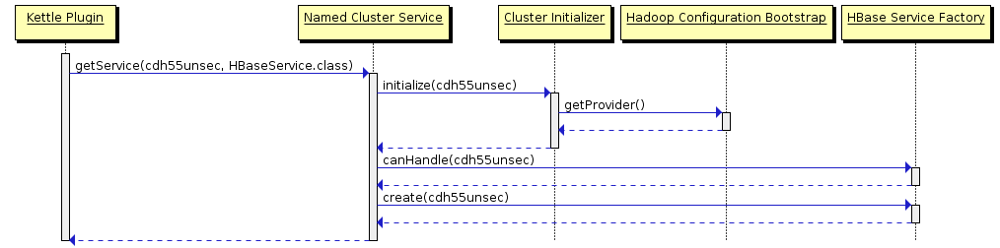
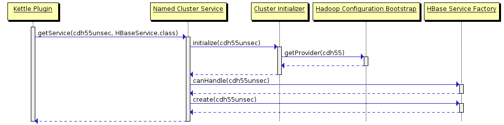

This outlines the anticipated changes needed to support multiple shims.

Standard services (accessed via steps/job entries)
--------------------------------------------------

Currently, the service location has unused hooks for the parts we think will be needed.

The current flow is as follows:


The adjusted flow is mostly the same:


First we need to add an attribute to the named cluster specifying the shim.

The getProvider() call to HadoopConfigurationBootstrap is what initializes a shim.  We need to change it to account for the shim selected in the named cluster so that it can initialize the right shim (or no-op if the shim has already been initialized).

The other major change isn't visible in the sequence diagram.  The HBaseServiceFactory's canHandle method needs to account for the selected shim in the named cluster (falling back to the default or "active" configuration if it is null) so

```java
  @Override public boolean canHandle( NamedCluster namedCluster ) {
    return isActiveConfiguration;
  }
```

becomes

```java
  @Override public boolean canHandle( NamedCluster namedCluster ) {
    String shim = namedCluster.getShim();
    if ( shim == null ) {
      return isActiveConfiguration;
    }
    return shim.equals( hadoopConfiguration.getIdentifier() );
  }
```

Limited context services (vfs, jdbc)
------------------------------------

We need a reference to the active MetaStore and the named cluster name in order to load a NamedCluster.

As far as locating the active metastore, [metastore locator plugin](https://github.com/pentaho/pentaho-kettle/tree/master/plugins/metastore-locator) will allow us to determine the right one.  We will probably need to flush out several more scenarios and implementations though.

We will somehow need to embed the named cluster name in the URL both to determine which shim to use as well as to associate other named cluster settings with VFS and JDBC connections once we add them.

Tools
-----
[sdedit4.0.1](https://sourceforge.net/projects/sdedit/files/sdedit/4.0/) was used to transform the .sd files into .pngs

```
java -jar ~/Downloads/sdedit-4.01.jar -o SingleShimHBase.png -t png SingleShimHBase.sd
java -jar ~/Downloads/sdedit-4.01.jar -o MultiShimHBase.png -t png MultiShimHBase.sd 
```
