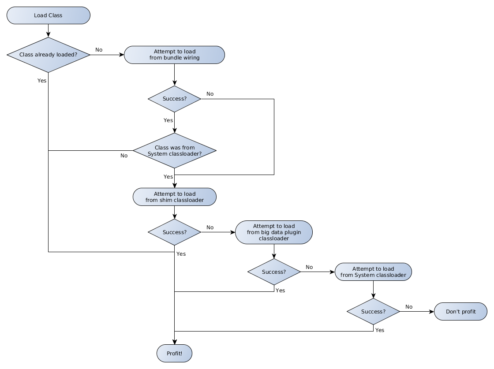

As a step towards a more flexible architecture less constrained by the shims, we have been refactoring the steps and job entries to use higher level services.  They follow the following pattern:

api
---
A higher level api that exposes big data capabilities as services with locators that take a NamedCluster as their argument.

These should only rely on kettle-core, the metastore, and other api bundles.

They will typically be made up of a [a service interface](https://github.com/pentaho/big-data-plugin/blob/master/api/pig/src/main/java/org/pentaho/bigdata/api/pig/PigService.java).

The Service (and any supporting classes for arguments and/or return types) is responsible for performing operations against the cluster.

impl/shim 
---------
An initial implementation of the api that delegates to the shim.

These are OSGi bundles that bridge over to the legacy plugin as well as the shim.  A [factory loader](https://github.com/pentaho/big-data-plugin/blob/master/impl/shim/pig/src/main/java/org/pentaho/big/data/impl/shim/pig/PigServiceFactoryLoader.java), a [factory](https://github.com/pentaho/big-data-plugin/blob/master/impl/shim/pig/src/main/java/org/pentaho/big/data/impl/shim/pig/PigServiceFactoryImpl.java), and a [service](https://github.com/pentaho/big-data-plugin/blob/master/impl/shim/pig/src/main/java/org/pentaho/big/data/impl/shim/pig/PigServiceImpl.java) need to be implemented.

The factory loader implements the [HadoopConfigurationListener](https://github.com/pentaho/big-data-plugin/blob/master/legacy/src/main/java/org/pentaho/di/core/hadoop/HadoopConfigurationListener.java) interface. Its job is [to instantiate a new factory and register it with the service locator](https://github.com/pentaho/big-data-plugin/blob/master/impl/shim/pig/src/main/java/org/pentaho/big/data/impl/shim/pig/PigServiceFactoryLoader.java) for each HadoopConfiguration that opens and unregister the factory when the HadoopConfiguration is closed.

The factory has two parent classloaders, the OSGi Bundle Context Classloader and the Shim's classloader.  This way it is able to implement the Factory interface and the Service it instantiates can use the shim classes to do the work.

The Service interface is able to reference anything in the shim to do its job but sticking with the hadoop shim api classes is preferable as they are less likely to change from shim to shim.

[Example blueprint](https://github.com/pentaho/big-data-plugin/blob/master/impl/shim/pig/src/main/resources/OSGI-INF/blueprint/blueprint.xml)

kettle-plugins
--------------
The step and job entry logic and dialog code.

These are able to depend on Kettle artifacts as well as api artifacts (above) but should NOT depend on the legacy plugin, the hadoop api, or any shim artifacts to do their job. They are OSGi bundles that provide Kettle plugins via blueprint.

They can use the [NamedClusterServiceLocator](https://github.com/pentaho/big-data-plugin/blob/master/api/clusterServiceLocator/src/main/java/org/pentaho/big/data/api/cluster/service/locator/NamedClusterServiceLocator.java) interface to get services for a given NamedCluster.

[Example blueprint](https://github.com/pentaho/big-data-plugin/blob/master/kettle-plugins/pig/src/main/resources/OSGI-INF/blueprint/blueprint.xml)
