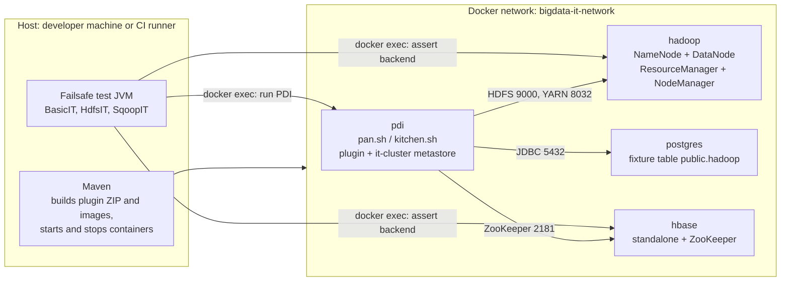
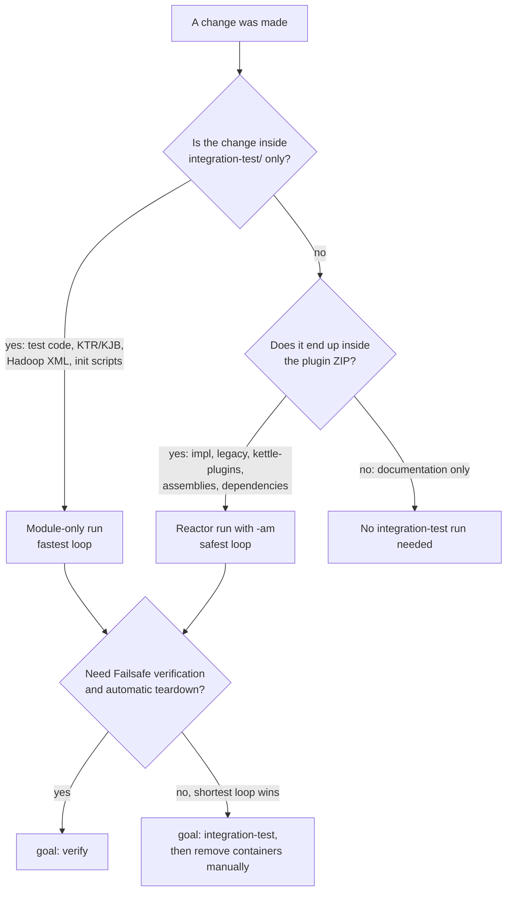
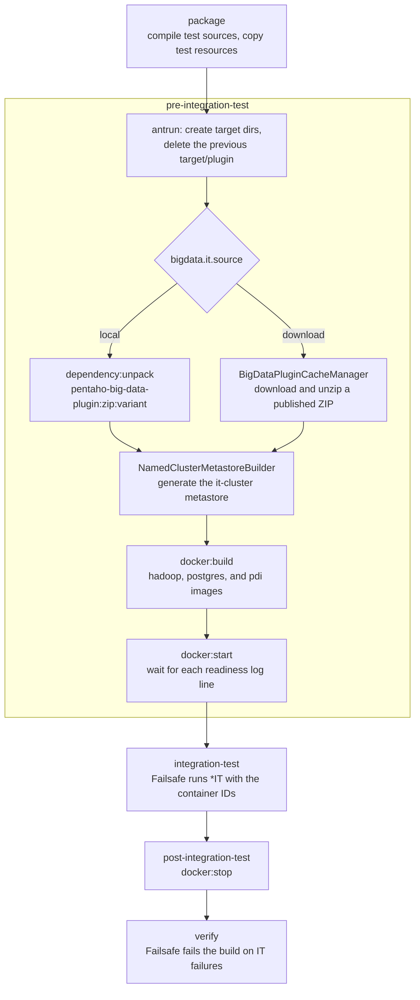
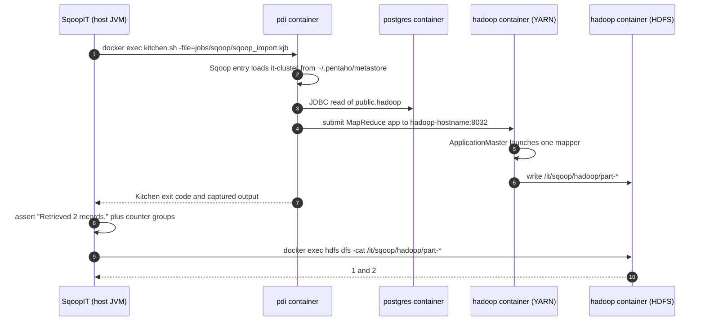

# Pentaho Big Data Plugin - Integration Tests

Functional, end-to-end tests for the `pentaho-big-data-plugin`. Every test runs a real PDI
transformation (`pan.sh`) or job (`kitchen.sh`) **inside** a `pdi-client` Docker container that has
the plugin installed, against sibling containers that run HDFS and YARN, PostgreSQL, and HBase. Each
test asserts **both** the backend state (files in HDFS, rows in HBase) and the **captured PDI log**.

The host-side Maven process is an orchestrator only. It builds the plugin and the container images,
starts the fixture, hands the container IDs to Failsafe, and stops the fixture. It never runs PAN,
Kitchen, Sqoop, or a Hadoop client on the host; tests reach the fixture exclusively through
`docker exec`. That boundary is deliberate, because only the PDI container has the classloader and
shim environment that the plugin needs.

This module mirrors the OpenLineage Plugin (OLP) integration-test infrastructure, adapted for the
CE big-data repository: the Docker helper is self-contained (plain `docker` CLI, no EE
`automation-utils` dependency).

## Contents

| Section | Read it when you want to |
| --- | --- |
| [Bird's-eye view](#birds-eye-view) | understand the moving parts in two minutes |
| [Layout](#layout) | find a file |
| [Quick start](#quick-start) | run the tests for the first time |
| [Choosing the right command](#choosing-the-right-command) | pick a fast or a safe loop after a change |
| [How the fixture works](#how-the-fixture-works) | debug the containers, the lifecycle, or a test |
| [Plugin variants and shims](#plugin-variants-and-shims) | test a shim other than `apachevanilla` |
| [Continuous integration](#continuous-integration) | know what PR and merge builds run |
| [Property reference](#property-reference) | look up a `-D` switch |
| [Troubleshooting](#troubleshooting) | decode a failure |
| [Status and improvement backlog](#status-and-improvement-backlog) | see what is done and what comes next |

## Bird's-eye view

Four containers on one Docker network, driven from the host by Maven:



Three rules explain almost everything else in this document:

1. **The plugin under test is a ZIP, not a source tree.** The PDI image is built from an assembled
   `pentaho-big-data-plugin` variant ZIP, so a plugin source change only reaches a test after that
   ZIP is rebuilt.
2. **Everything runs inside Docker.** `hadoop-hostname`, `postgres-hostname`, and `hbase-hostname`
   are Docker DNS names; they resolve only from inside the network.
3. **Client and server configuration must agree.** The Hadoop container reads its `*-site.xml` files
   from its image, while PDI reads an equivalent set from the generated `it-cluster` metastore. When
   the two drift apart, jobs fail at submission time instead of at startup.

### Test inventory

| Test | Status | What it proves | Backend assertion |
| --- | --- | --- | --- |
| `BasicIT` | active | the PDI container starts and the plugin loads | none (log only) |
| `HdfsIT` | active | `hc://` write and read round trip through the shim | `hdfs dfs -test -e`, `hdfs dfs -cat` |
| `SqoopIT` | active | Sqoop import from PostgreSQL through YARN into HDFS | `hdfs dfs -cat /it/sqoop/hadoop/part-*` |
| `HBaseIT` | `@Disabled` | HBase write and read round trip | `hbase shell` scan |
| `FormatsIT` | `@Disabled` | Parquet, Avro, and ORC round trips over HDFS | `hdfs dfs -test -e` |

The disabled tests already have Java code and most of their KTR fixtures; they are waiting on
fixture validation, not on new infrastructure.

## Layout

```text
integration-test/
  pom.xml                                parent pom: docker network, plugin management, host
                                         profiles, Failsafe defaults (retry once, parallelism switch)
  pentaho-platform/
    pom.xml                              main IT module: plugin unpack or download, image builds,
                                         containers, metastore generation, Failsafe properties
    docker/
      hadoop/config/*.xml                core-site, hdfs-site, yarn-site, mapred-site (server side)
      hadoop/scripts/init-hdfs.sh        creates /it/hdfs and /it/formats after HDFS starts
      postgres/init/01-create-hadoop.sql fixture table and rows used by the Sqoop import
    src/test/java/org/pentaho/big/data/it/
      DockerUtils.java                   docker exec / cp wrapper (ProcessBuilder, 5-minute timeout)
      ITUtils.java                       container paths, property keys, HDFS/HBase helpers
      BigDataPluginIT.java               base class: runTransformation(...) and runJob(...)
      BigDataPluginCacheManager.java     downloads a published plugin variant (download mode)
      NamedClusterMetastoreBuilder.java  generates the it-cluster metastore and its site files
      ExecutionType.java                 execution mode enum (PAN only today)
      BasicIT.java                       smoke test
      HdfsIT.java                        HDFS write/read round trip
      SqoopIT.java                       PostgreSQL-to-HDFS import through YARN
      HBaseIT.java                       HBase write/read round trip (@Disabled)
      FormatsIT.java                     Parquet/Avro/ORC round trips (@Disabled)
    src/test/resources/transformations/
      basic/basic_smoke.ktr
      hdfs/hdfs_output.ktr, hdfs/hdfs_input.ktr
      hbase/hbase_output.ktr, hbase/hbase_input.ktr
      formats/parquet_output.ktr, formats/parquet_input.ktr
      formats/orc_output.ktr, formats/orc_input.ktr
    src/test/resources/jobs/sqoop/
      sqoop_import.kjb                   Kitchen job that submits the Sqoop import
```

## Quick start

### Prerequisites

- A running Docker daemon with enough CPU, memory, and disk for four containers. The Hadoop
  container alone runs NameNode, DataNode, ResourceManager, and NodeManager, and YARN reserves
  2 GiB for its single NodeManager.
- JDK 11 or later and Maven 3.6 or later on the host (both enforced by `maven-enforcer-plugin`).
  The Hadoop and PDI images run Java 21 inside the containers; the derived Hadoop image installs
  its own JDK and does not depend on the host JDK.
- Access to the Pentaho Docker registry that hosts `automation/pdi-client`
  (`pntprv-docker-dev-orl.repo.eng.pentaho.com` by default): VPN plus `docker login`. Override the
  registry with `-Dpentaho.docker.pull.host=<registry>/`.
- On **Windows**, expose the daemon on `tcp://localhost:2375` (Docker Desktop:
  *Settings -> General -> Expose daemon on tcp://localhost:2375 without TLS*). The `windows-host`
  profile then sets `bigdata.it.dockerHost`. Linux uses the Unix socket and macOS uses `DOCKER_HOST`.

### First run

Integration tests are **off by default**; the `runIntegrationTests` property turns them on. Two
commands are enough for a complete first run:

```powershell
# 1. Build and install the plugin ZIP that the containers will use.
mvn clean install -Papachevanilla -Dmaven.test.skip=true

# 2. Start the fixture and run every enabled integration test.
mvn -pl integration-test/pentaho-platform verify -DrunIntegrationTests -Papachevanilla
```

Step 1 uses `-Dmaven.test.skip=true` because it only has to produce the plugin ZIP and its
dependencies; step 2 runs the tests. `install` (rather than `package`) is required, because a
module-only run resolves the versioned ZIP from the local Maven repository. `package` leaves the ZIP
in `assemblies/pentaho-big-data-plugin/target`, where a separate Maven invocation cannot find it.

### Reading the result

| Where | What it tells you |
| --- | --- |
| Maven console | image builds, container readiness waits, Failsafe summary |
| `integration-test/pentaho-platform/target/failsafe-reports/*.txt` | per-test outcome and failure message |
| `integration-test/pentaho-platform/target/failsafe-reports/failsafe-summary.xml` | completed, errors, failures, skipped, flakes |
| `docker logs <container>` | fixture-side detail while the containers are still running |

A clean focused Sqoop run reports one test with zero failures, errors, and skips, leaves the YARN
application in `FINISHED` / `SUCCEEDED`, and leaves the values `1` and `2` in HDFS.

### Cleaning up

`verify` stops the containers during `post-integration-test`. When a run is interrupted, or when the
`integration-test` goal is used on its own, remove only the test-owned containers:

```powershell
$ids = docker ps -aq --filter "name=^/bigdata-it-"
if ($ids) { docker rm -f $ids }
```

## Choosing the right command

The plugin under test is a ZIP, so the only question that really matters is whether that ZIP has to
be rebuilt:



The default `local` source unpacks the plugin variant produced by the Maven reactor; the `download`
source unpacks a published complete variant instead (see
[Plugin variants and shims](#plugin-variants-and-shims)).

### Which plugin build do the tests use?

The integration-test module does not execute the plugin directly from its source directories. With
the default `bigdata.it.source=local`, its `pre-integration-test` phase does the following:

1. Deletes the previous `integration-test/pentaho-platform/target/plugin` directory.
2. Resolves `pentaho:pentaho-big-data-plugin:<version>:zip:<variant>`.
3. Unpacks that ZIP into `target/plugin`.
4. Copies the unpacked plugin, test resources, metastore, and fixture configuration into the PDI
  Docker build context.
5. Starts fresh fixture containers and runs the selected Failsafe tests.

The ZIP can come from either of two places:

| Invocation style | ZIP selected by the test | Best use |
| --- | --- | --- |
| `-pl integration-test/pentaho-platform -am ...` from the repository root | The current reactor build of the plugin, including source changes in this checkout | Safest loop after changing plugin source or packaging |
| Running Maven only in `integration-test/pentaho-platform` | A ZIP already installed in the local Maven repository, or another repository resolver can provide | Fastest loop after the plugin ZIP has been installed |

Maven does not read `pentaho-big-data-plugin/target/*.zip` directly during a module-only run. A
ZIP that exists only in `target` can therefore leave the test using an older installed artifact,
or cause dependency resolution to fail. Check the local repository when in doubt:

```powershell
Get-ChildItem "$env:USERPROFILE\.m2\repository\pentaho\pentaho-big-data-plugin\11.1.0.0-SNAPSHOT" `
  -Filter "*apachevanilla*.zip" -File
```

The file under `target/plugin` is the copy that will actually be mounted into PDI. It is deleted
and recreated on every integration-test run, so stale files in that directory do not survive a
normal run. The important freshness boundary is the ZIP that Maven resolves before unpacking it.

### When must the plugin ZIP be rebuilt?

Use these rules when deciding whether a source change requires a package rebuild:

| Change made | Rebuild/install the plugin ZIP? | Reason |
| --- | --- | --- |
| `SqoopIT.java`, `BigDataPluginIT.java`, `ITUtils.java`, or another integration-test Java class | No | The module compiles test sources before Failsafe runs them. |
| A job, transformation, or other file under `integration-test/pentaho-platform/src/test/resources` | No | Maven test resources and the Docker build context are refreshed for the run. |
| Hadoop XML files, `init-hdfs.sh`, PostgreSQL initialization, or other integration-test Docker resources | No | These files belong to the fixture and are copied/rebuilt by the integration-test module. |
| Named-cluster generation or metastore-related integration-test code | No | The named cluster is generated during the test module's pre-integration setup. |
| Java or resource code that is packaged into `pentaho-big-data-plugin` | Yes | The PDI container consumes the packaged ZIP, not the plugin source tree. |
| `impl`, `legacy`, `kettle-plugins`, plugin assemblies, shim contents, or plugin packaging/dependency configuration | Yes | These changes affect the contents or dependencies of the ZIP under test. |
| Only this README or other documentation | No | Documentation is not part of the runtime fixture. |

After changing plugin source, either rebuild it into the reactor and run the test in the same
reactor, or install the new ZIP before using the faster module-only command.

### Fast loop after changing only integration-test code

When the plugin ZIP is already installed and the change is limited to the integration-test module,
run from `integration-test/pentaho-platform`:

```powershell
mvn.cmd -T 4 `
  -Dtest=NoSuchTest `
  -DfailIfNoTests=false `
  -DrunIntegrationTests `
  -Dit.test=SqoopIT `
  -Dbigdata.it.plugin-variant=apachevanilla `
  -Dpentaho.docker.pull.host=one.hitachivantara.com/pnt-docker/ `
  integration-test
```

This avoids rebuilding the parent reactor and the plugin ZIP. It still rebuilds the integration-test
module's test resources and fixture image contexts, starts Hadoop/YARN, PostgreSQL, HBase, and PDI,
and runs only `SqoopIT`. Because the goal stops before `post-integration-test`, remove the test-owned
containers after a diagnostic run:

```powershell
docker ps -aq --filter "name=^/bigdata-it-" | ForEach-Object { docker rm -f $_ }
```

Use `verify` instead of `integration-test` when automatic Failsafe verification and Docker teardown
are more important than the shortest feedback loop.

### Loop after changing plugin source

The most reliable option is to let Maven rebuild the current plugin and the integration test in one
reactor. Run from the repository root:

```powershell
mvn.cmd -T 4 `
  -Papachevanilla `
  -Dtest=NoSuchTest `
  -DfailIfNoTests=false `
  -DrunIntegrationTests `
  -Dit.test=SqoopIT `
  -Dpentaho.docker.pull.host=one.hitachivantara.com/pnt-docker/ `
  -pl integration-test/pentaho-platform `
  -am `
  integration-test
```

Here `-am` includes the modules needed to produce the current `apachevanilla` ZIP. This is the
recommended command when changing plugin implementation code, shim contents, assembly metadata, or
dependencies, because it cannot accidentally reuse an older ZIP from `.m2`.

If several tests will be run against the same rebuilt ZIP, install it once and then use the module-only
loop for subsequent test iterations:

```powershell
# Run from the repository root.
mvn.cmd -T 4 -Papachevanilla -Dmaven.test.skip=true install
```

The next module-only invocation will unpack this newly installed ZIP. Use `clean install` for the
first build, after changing assembly/package structure, or when generated output is suspected to be
stale; use incremental `install` for normal source changes.

### Change-handling decision guide

1. Change only an integration-test class, job, fixture script, Hadoop configuration, or test resource:
  run the module-only focused command.
2. Change plugin implementation, shim code, assembly contents, or plugin dependencies:
  run the reactor command with `-am`, or run `install` from the root before the module-only command.
3. Change the plugin variant or switch between local and published plugin testing:
  set `-Dbigdata.it.plugin-variant=...` and review `bigdata.it.source`; do not assume a previous ZIP
  has the new variant.
4. Finish with `verify` when the full lifecycle, Failsafe verification, and container teardown need
  to be part of the result.

Do not use `-DskipTests` as a shortcut for this workflow. The focused `-Dtest=NoSuchTest` plus
`-Dit.test=SqoopIT` selection keeps unit-test execution quiet while preserving the integration-test
lifecycle and making the Failsafe result visible.

### PR / merge (run the complete local fixture)

```bash
mvn -pl integration-test/pentaho-platform verify -DrunIntegrationTests -Papachevanilla
```

This unpacks the locally built `pentaho-big-data-plugin` `apachevanilla` ZIP into the PDI container,
starts the Hadoop/HBase/PostgreSQL fixture, runs the Failsafe integration tests, and stops the
containers during `post-integration-test`.

### Focused Sqoop validation

For the PostgreSQL-to-HDFS path, use the focused command below. `-Dtest=NoSuchTest` prevents
Surefire unit tests from adding noise to the diagnostic run; `-Dit.test=SqoopIT` selects the
integration test. Do not replace this with `-DskipTests`: that can also suppress the integration
test lifecycle in ways that hide whether the fixture was exercised.

From PowerShell on Windows, `Start-Process -Wait` keeps Maven's real exit code and avoids the
interactive batch-job prompt that can appear when a long `mvn.cmd` process is launched directly:

```powershell
$ids = docker ps -aq --filter "name=^/bigdata-it-"
if ($ids) { docker rm -f $ids }

$maven = Start-Process -FilePath "mvn.cmd" -ArgumentList @(
  "-T", "4",
  "-Papachevanilla",
  "-Dtest=NoSuchTest",
  "-DfailIfNoTests=false",
  "-DrunIntegrationTests",
  "-Dit.test=SqoopIT",
  "-Dpentaho.docker.pull.host=one.hitachivantara.com/pnt-docker/",
  "-pl", "integration-test/pentaho-platform",
  "-am",
  "integration-test"
) -WorkingDirectory "C:\Users\<user>\path\to\big-data-plugin" `
  -Wait -PassThru `
  -RedirectStandardOutput "sqoop-focused.out" `
  -RedirectStandardError "sqoop-focused.err"

Write-Output "Maven exit code: $($maven.ExitCode)"
```

Replace the working directory and registry override with values for the local environment. The
equivalent command from a Unix shell is:

```bash
mvn -T 4 -Papachevanilla \
  -Dtest=NoSuchTest -DfailIfNoTests=false \
  -DrunIntegrationTests -Dit.test=SqoopIT \
  -Dpentaho.docker.pull.host=one.hitachivantara.com/pnt-docker/ \
  -pl integration-test/pentaho-platform -am integration-test
```

Use the `integration-test` goal for a fast, focused diagnostic loop. Use `verify` for the final
lifecycle so Failsafe verification and Docker teardown also run:

```bash
mvn -T 4 -Papachevanilla \
  -DrunIntegrationTests \
  -Dpentaho.docker.pull.host=one.hitachivantara.com/pnt-docker/ \
  -pl integration-test/pentaho-platform -am verify
```

The expected focused Sqoop result is one test with zero failures, errors, or skips. The test also
leaves the Hadoop application in YARN `FINISHED` / `SUCCEEDED` state and verifies that HDFS contains
the two imported values `1` and `2`.

### Show Kitchen output in Maven

Kitchen output is captured by the test JVM so it can be asserted without requiring a host-side
Kitchen process. Pass the following user property to mirror the captured stdout and stderr from each
`kitchen.sh` invocation to the Maven test output while the command is running:

```powershell
mvn.cmd -T 4 `
  -Dtest=NoSuchTest `
  -DfailIfNoTests=false `
  -DrunIntegrationTests `
  -Dit.test=SqoopIT `
  -Dbigdata.it.show-kitchen-logs=true `
  -Dpentaho.docker.pull.host=one.hitachivantara.com/pnt-docker/ `
  integration-test
```

Look for markers like these in the Maven output:

```text
----- Kitchen output: sqoop/sqoop_import.kjb -----
...
Retrieved 2 records.
...
----- End Kitchen output: sqoop/sqoop_import.kjb -----
```

The default is `false`, so normal test runs retain the shorter output. The property affects only
Kitchen jobs; PAN transformation output remains captured for assertions and is not printed by this
switch.

### Assert Kitchen log content

`BigDataPluginIT.runJob(...)` supports required and forbidden log fragments. The existing three-argument
form asserts required fragments only:

```java
runJob(
  "sqoop/sqoop_import.kjb",
  true,
  List.of( "Retrieved 2 records." ) );
```

Use the four-argument form when a test must also ensure that a word or message is absent:

```java
runJob(
  "sqoop/sqoop_import.kjb",
  true,
  List.of( "Retrieved 2 records.", " completed successfully" ),
  List.of( "ERROR", "Job failed" ) );
```

Each item is matched as a literal substring against the combined Kitchen stdout and stderr. A
missing required fragment or a present forbidden fragment fails the test with the job path and the
offending assertion in the failure message. The method returns the complete combined output when a
test needs a more specific assertion:

```java
String kitchenOutput = runJob( "sqoop/sqoop_import.kjb", true, null, null );
assertThat( kitchenOutput ).contains( "Retrieved 2 records." );
```

Keep assertions focused on stable business results and failure indicators. The Sqoop test asserts
`Retrieved 2 records.`, `File System Counters`, and `Job Counters`, then verifies the HDFS values
separately. Use `-Dbigdata.it.show-kitchen-logs=true` while developing a new assertion to inspect
the exact text emitted by Kitchen, then keep the assertion at the narrowest stable fragment.

### Harness constraints worth knowing

| Constraint | Where it is defined | Why it matters |
| --- | --- | --- |
| Every `docker exec` is killed after 5 minutes | `DockerUtils.run(...)` | A slow PAN or Kitchen run fails with `Command timed out`, which looks like a hang but is the harness giving up |
| Failed tests are retried once | `rerunFailingTestsCount` in `integration-test/pom.xml` | A flaky test can still report success; check the `flakes` count in `failsafe-summary.xml` |
| Tests run sequentially by default | `bigdata.it.parallel=false` | The single-node fixture shares HDFS paths, so parallel runs need distinct paths first |
| Default PDI log level is `Detailed` | `bigdata.it.transformation-log-level` | Lower it to `Basic` for faster, quieter runs; raise it while debugging a step |
| stdout and stderr are drained on separate threads | `DockerUtils.readStreamAsync(...)` | PDI easily fills a 64 KB pipe buffer; single-threaded reads would deadlock |

## How the fixture works

The integration-test automation creates a temporary, Dockerized single-node HDFS and YARN
deployment. It never installs Hadoop on the host and never connects to a Hadoop installation that is
already running there. Hadoop, PostgreSQL, HBase, and PDI are separate containers on one Docker
network, and every one of them is disposable.

### Runtime topology

| Container | Image built from | DNS alias | Role |
| --- | --- | --- | --- |
| `bigdata-it-hadoop-*` | `apache/hadoop:3.3.6` + Java 21 + IT config | `hadoop-hostname` | NameNode, DataNode, ResourceManager, NodeManager, `mapreduce_shuffle` |
| `bigdata-it-postgres-*` | `postgres:18` + init SQL | `postgres-hostname` | Sqoop source database with the `public.hadoop` fixture table |
| `bigdata-it-hbase-*` | `harisekhon/hbase:2.1` (used as is) | `hbase-hostname` | standalone HBase with embedded ZooKeeper |
| `bigdata-it-pdi-*` | `automation/pdi-client:11.1` + plugin, jobs, metastore | `pdi-hostname` | runs `pan.sh` and `kitchen.sh` through `docker exec` |

Ports published to the host, for diagnostics only:

| Port | Service | Typical use |
| --- | --- | --- |
| `9000` | HDFS NameNode RPC | client tooling on the host |
| `9870` | NameNode HTTP UI | `http://localhost:9870` |
| `5432` | PostgreSQL | inspect the fixture table |
| `2181` / `16000` | ZooKeeper / HBase master | HBase client tooling |
| `5005` | PDI debug port | attach a remote debugger to PDI |

YARN ports (`8030`-`8033`, `8088`) stay inside the Docker network and are not published. Add a
temporary mapping when the ResourceManager UI is genuinely needed.

Docker's embedded DNS resolves the aliases above from other containers on the network. They are not
host names, so the following is expected to fail on the host:

```text
ping hadoop-hostname
```

Use `docker exec` from a running container, or inspect the Docker network, when checking these
names. The tests themselves always use container-local commands rather than `localhost`.

The Hadoop container is a single-node HDFS and YARN cluster. It starts one NameNode, one DataNode,
one ResourceManager, and one NodeManager, with the `mapreduce_shuffle` auxiliary service enabled.
The PDI container submits the Sqoop MapReduce application to this ResourceManager; the mapper runs
in a YARN container managed by the NodeManager. YARN ports are available through Docker DNS inside
the network and are not required to be published to Windows.

### Maven lifecycle

The `runIntegrationTests` property activates the `bigdata-it-profile` in both
`integration-test/pom.xml` and `integration-test/pentaho-platform/pom.xml`. Most of the work happens
in `pre-integration-test`:



Step by step:

1. Maven creates the host-side staging directories under `target`, including the generated
   metastore, Kettle configuration, and plugin unpack directory. The plugin directory is deleted
   first so a previous variant cannot leak into the next container image.
2. In local mode, Maven unpacks the selected, locally assembled plugin ZIP. In download mode,
   `BigDataPluginCacheManager` downloads and unpacks a published complete plugin ZIP instead.
3. `NamedClusterMetastoreBuilder` writes the `it-cluster` definition into the test metastore. It
  records `hdfs://hadoop-hostname:9000` as the HDFS endpoint, `hbase-hostname:2181` as the
  ZooKeeper endpoint, and `hadoop-hostname:8032` as the YARN ResourceManager endpoint. It embeds
  the HDFS, YARN, MapReduce, and HBase site files used by the PDI-side Hadoop client.
4. Fabric8's Docker Maven Plugin builds the derived Hadoop, PostgreSQL, and PDI images, then starts
  the four containers. `startParallel` is `false`, and the PDI container declares `dependsOn` for
  the three backends, so PDI cannot start before the backends pass their readiness checks.
5. Failsafe receives the running container IDs as system properties such as
  `bigdata.it.pdi-container-id` and `bigdata.it.hadoop-container-id`. The test classes pass those
  IDs to `DockerUtils.exec`, which keeps all PDI and backend commands inside Docker.

The phase order matters when reading a failed build: Maven runs `post-integration-test` (container
teardown) **before** `verify` (the goal that turns integration-test failures into a build failure).
A broken teardown therefore stops the build before the Failsafe verdict is printed, even though the
Failsafe reports on disk are already complete.

The Hadoop data is not backed by a host volume, so the cluster must be treated as ephemeral. If
Maven is interrupted before teardown, remove only the test-owned containers before the next run
(see [Troubleshooting](#troubleshooting)).

#### Readiness gates

The Docker Maven Plugin waits on container log lines rather than on host TCP ports, because on
Docker-in-Docker and Kubernetes runners published ports are not reachable from the Maven process
while container logs always are.

| Container | Log line waited for | Timeout | Meaning |
| --- | --- | --- | --- |
| hadoop | `YARN ready` | 180 s | NameNode serving, DataNode registered, one NodeManager visible to `yarn node -list` |
| postgres | `database system is ready to accept connections` | 120 s | init SQL has run and the server accepts clients |
| hbase | `service=ClientService` | 180 s | HBase is serving client requests |
| pdi | none (starts after the three above) | - | container is idle in `tail -f /dev/null`, waiting for `docker exec` |

### Building the Hadoop image

The Hadoop image is built from the property `bigdata.it.hadoop-image`, which defaults to
`apache/hadoop:3.3.6`. The derived image is tagged as
`bigdata-it-hadoop:${bigdata.it.pdi-version}` (normally `bigdata-it-hadoop:11.1`). The Maven
configuration sends the following files into the Docker build context and copies them into the
image:

| Source | Image location | Purpose |
| --- | --- | --- |
| `docker/hadoop/config/core-site.xml` | `/opt/hadoop/it-config/core-site.xml` | Default HDFS URI and Hadoop user settings |
| `docker/hadoop/config/hdfs-site.xml` | `/opt/hadoop/it-config/hdfs-site.xml` | Single-node NameNode/DataNode storage and network settings |
| `docker/hadoop/config/yarn-site.xml` | `/opt/hadoop/it-config/yarn-site.xml` | ResourceManager, NodeManager, and shuffle-service settings |
| `docker/hadoop/config/mapred-site.xml` | `/opt/hadoop/it-config/mapred-site.xml` | YARN MapReduce framework, classpath, environment, and JVM settings |
| `docker/hadoop/scripts/init-hdfs.sh` | `/opt/hadoop/it-scripts/init-hdfs.sh` | Creates `/it/hdfs` and `/it/formats` after HDFS starts |

These files are baked into the image rather than bind-mounted from the Windows workspace. This is
important when the Docker daemon is remote or running inside Docker-in-Docker: the daemon can use
the files from the build context even when it cannot see the host filesystem at runtime.

The derived image also installs a Java 21 JDK at `/opt/jdk21` using the current Adoptium latest-GA
API URL:

```text
curl -fsSL --retry 3 -o /tmp/jdk21.tar.gz \
  https://api.adoptium.net/v3/binary/latest/21/ga/linux/x64/jdk/hotspot/normal/eclipse
mkdir -p /opt/jdk21
tar -xzf /tmp/jdk21.tar.gz -C /opt/jdk21 --strip-components=1
```

The URL is compatible with Java 21 but is not a byte-for-byte pinned dependency. Reproducible
image builds should replace it with a pinned artifact and checksum.

### Hadoop server configuration

The four Hadoop XML files above are copied into Hadoop's active configuration directory when the
container starts. Their important settings are:

`core-site.xml`:

- `fs.defaultFS` is `hdfs://hadoop-hostname:9000`, so Hadoop clients use the NameNode's Docker DNS
  alias and RPC port.
- The static HTTP user is set to `root` for the test container.

`hdfs-site.xml`:

- `dfs.replication` is `1`, because there is only one DataNode.
- HDFS permissions are disabled for this test-only cluster.
- NameNode metadata is stored at `file:///tmp/hdfs/name`.
- DataNode blocks are stored at `file:///tmp/hdfs/data`.
- The NameNode RPC service is `hadoop-hostname:9000` and binds to `0.0.0.0` inside the container.
- The NameNode HTTP service binds to `0.0.0.0`, making the mapped port `9870` available for local
  diagnostics.
- The DataNode advertises `hadoop-hostname`, and HDFS clients are instructed to use the hostname
  instead of an internal container address when connecting to the DataNode. This lets the PDI
  container follow the NameNode's block-location responses over the shared Docker network.

`yarn-site.xml`:

- ResourceManager RPC, scheduler, resource-tracker, admin, and web endpoints use
  `hadoop-hostname` on ports `8032`, `8030`, `8031`, `8033`, and `8088`.
- The NodeManager uses `hadoop-hostname` and enables the `mapreduce_shuffle` auxiliary service.
- The single NodeManager advertises `2048` MiB. Container allocation is bounded between `256` and
  `2048` MiB, which is enough for the one-mapper Sqoop job.
- Virtual-memory and physical-memory checks are disabled to keep the small single-node fixture
  from rejecting the test JVMs for container accounting overhead.

`mapred-site.xml`:

- `mapreduce.framework.name=yarn` sends MapReduce applications to the ResourceManager instead of
  running them in local mode.
- The application classpath is explicitly `/opt/hadoop/share/hadoop/mapreduce/*` plus its `lib`
  directory.
- `mapreduce.jvm.add-opens-as-default=false` prevents Hadoop from passing the literal
  `<ADD_OPENS>` placeholder to Java 21 processes.
- `HADOOP_MAPRED_HOME=/opt/hadoop` is propagated to the ApplicationMaster, mapper, and reducer.
- The ApplicationMaster, mapper, and reducer receive explicit Java 21 memory and module-opening
  options. The mapper and reducer use `-Xmx384m`; the ApplicationMaster uses `-Xmx1024m` and all
  three include `--add-opens java.base/java.lang=ALL-UNNAMED`.

The Hadoop daemon environment also sets `JAVA_HOME=/opt/jdk21` and
`HADOOP_OPTS=--add-opens java.base/java.lang=ALL-UNNAMED`. The latter is required because Hadoop
3.3.6 uses Guice/CGLIB paths that reflect into `java.lang.ClassLoader` when the daemons run on Java
21. The same MapReduce options are generated into the PDI named-cluster metastore so the client
configuration and server configuration agree.

There are no persistent volumes for `/tmp/hdfs/name` or `/tmp/hdfs/data`. A newly created Hadoop
container therefore starts with an empty filesystem and must format its NameNode again.

### Container startup and formatting

The base `apache/hadoop` image does not start Hadoop daemons by itself. The Docker Maven Plugin
overrides the container command with the following sequence:

```bash
export HADOOP_HOME="${HADOOP_HOME:-/opt/hadoop}"
export HADOOP_CONF_DIR="$HADOOP_HOME/etc/hadoop"
cp /opt/hadoop/it-config/*.xml "$HADOOP_HOME/etc/hadoop/"
if [ ! -d /tmp/hdfs/name/current ]; then
  "$HADOOP_HOME/bin/hdfs" namenode -format -force -nonInteractive
fi
"$HADOOP_HOME/bin/hdfs" --daemon start namenode
for i in $(seq 1 60); do
  if "$HADOOP_HOME/bin/hdfs" dfs -ls / >/dev/null 2>&1; then break; fi
  sleep 1
done
"$HADOOP_HOME/bin/hdfs" --daemon start datanode
"$HADOOP_HOME/bin/yarn" --daemon start resourcemanager
"$HADOOP_HOME/bin/yarn" --daemon start nodemanager
for i in $(seq 1 60); do
  if "$HADOOP_HOME/bin/yarn" node -list 2>/dev/null | grep -q "Total Nodes:1"; then break; fi
  sleep 2
done
echo "YARN ready"
tr -d '\r' < /opt/hadoop/it-scripts/init-hdfs.sh | bash
exec tail -f /dev/null
```

The sequence has these roles:

1. It selects the Hadoop installation, defaulting to `/opt/hadoop`.
2. It installs the integration-test XML files into Hadoop's active configuration directory.
3. It checks for the NameNode `current` directory. If it is absent, the NameNode is formatted
   non-interactively. Formatting is safe here because the container has no persistent HDFS data.
4. It starts the NameNode and waits until an HDFS client can list the root directory.
5. It starts the DataNode, ResourceManager, and NodeManager, then waits for YARN to report one
  registered NodeManager.
6. It prints `YARN ready`, runs `init-hdfs.sh` to create the base test directories, and keeps the
  container alive with `tail -f /dev/null`. The daemons continue running in the background.

### Readiness detection

The Hadoop wait (see [Readiness gates](#readiness-gates)) succeeds only when the container prints
`YARN ready`, which happens after the ResourceManager and NodeManager have started and the
NodeManager is visible to `yarn node -list`. The HDFS probe that precedes it confirms that the
NameNode is serving client requests, and `init-hdfs.sh` performs a second HDFS probe before creating
`/it/hdfs` and `/it/formats`. The PDI container starts only after Hadoop, PostgreSQL, and HBase have
all satisfied their waits.

### PDI-to-HDFS connection

There are two separate configuration layers:

1. The Hadoop image contains the server-side `core-site.xml`, `hdfs-site.xml`, `yarn-site.xml`,
  and `mapred-site.xml` described above.
2. The test build generates a PDI metastore named `it-cluster`. The generated named cluster points
  PDI at `hadoop-hostname:9000`, points YARN at `hadoop-hostname:8032`, and embeds matching HDFS,
  YARN, MapReduce, and HBase site settings. That metastore is assembled into the PDI container
  under `~/.pentaho/metastore`.

The PDI container also receives the selected plugin ZIP, `.ktr` files, and `.kjb` files as image
content. The test code runs `pan.sh` and `kitchen.sh` inside that container with `docker exec`. The
transformations use paths such as:

```text
hc://it-cluster/it/hdfs/cars.csv
```

The `hc://` scheme resolves the named cluster through the Big Data plugin and its selected shim;
the shim then uses the HDFS endpoint in the named-cluster configuration. The active `HdfsIT` test
writes the file, checks it directly with `hdfs dfs -test -e` and `hdfs dfs -cat` inside the Hadoop
container, and reads it back through a second PDI transformation.

### Execution boundary: no local runner

The test JVM runs on the host, but it never launches a local PAN or Kitchen process. The execution
boundary is explicit in [`BigDataPluginIT.java`](pentaho-platform/src/test/java/org/pentaho/big/data/it/BigDataPluginIT.java):

1. `runTransformation(...)` builds a `pan.sh` command and passes it to `DockerUtils.exec` with the
  PDI container ID.
2. `runJob(...)` builds a `kitchen.sh` command and passes it to the same PDI container.
3. The PDI process loads the plugin and named-cluster metastore from the PDI image. This preserves
  the PDI classloader and shim environment that the Sqoop job requires.
4. A Sqoop import started by Kitchen runs its Sqoop driver in the PDI container, reads PostgreSQL
  through the Docker network, and submits the MapReduce work to the Hadoop container's YARN
  ResourceManager. The mapper itself runs under the NodeManager in a YARN application container.
5. Backend assertions use `DockerUtils.exec` again: `hdfs dfs` runs in the Hadoop container and
  HBase shell commands run in the HBase container.

This distinction matters on Windows: `hadoop-hostname`, `postgres-hostname`, and
`hbase-hostname` are Docker-network names, not host names, and the plugin's runtime classloader is
available in the PDI container rather than in the Maven process. Running the Sqoop job through a
local runner bypasses that PDI classloader and can fail before submission with `Class hadoop not
found`; keeping Kitchen in PDI preserves the runtime that owns the plugin and shim.

### Where `it-cluster` is configured inside PDI

The `it-cluster` definition is generated during `pre-integration-test`; it is not a static fixture
in the PDI image. The `build-named-cluster-metastore` execution invokes
`NamedClusterMetastoreBuilder` with the host, port, and cluster-name properties from the POM. The
builder creates a Pentaho XML metastore entry and stages it on the host at:

```text
integration-test/pentaho-platform/target/classes/metastore/
```

The generated entry is stored under:

```text
target/classes/metastore/pentaho/NamedCluster/it-cluster.xml
```

The PDI image's `root-resources` assembly copies the generated metastore to `/root` and writes it
under `.pentaho/metastore`. In the running PDI container, where the current image runs with
`HOME=/root`, the effective path is:

```text
/root/.pentaho/metastore/pentaho/NamedCluster/it-cluster.xml
```

The generated named cluster contains these values:

| Setting | Value |
| --- | --- |
| Cluster name | `it-cluster` |
| Storage scheme | `hdfs` |
| HDFS host and port | `hadoop-hostname:9000` |
| `fs.defaultFS` | `hdfs://hadoop-hostname:9000` |
| HDFS username/password | Empty; the test cluster uses simple, unauthenticated access |
| ZooKeeper host and port | `hbase-hostname:2181` |
| JobTracker/ResourceManager host/port | `hadoop-hostname:8032` |
| Oozie URL | Empty |
| Gateway | Disabled |

The metastore entry also embeds five site files generated by
`NamedClusterMetastoreBuilder`:

- `core-site.xml` with `fs.defaultFS=hdfs://hadoop-hostname:9000`;
- `hdfs-site.xml` with `dfs.replication=1`;
- `yarn-site.xml` with ResourceManager and NodeManager endpoints on `hadoop-hostname`;
- `mapred-site.xml` with `mapreduce.framework.name=yarn`, the explicit MapReduce classpath,
  `HADOOP_MAPRED_HOME`, and Java 21 ApplicationMaster/task options; and
- `hbase-site.xml` with `hbase.zookeeper.quorum=hbase-hostname` and client port `2181`.

`HdfsIT` passes `it-cluster` to PAN through the `NAMED_CLUSTER` parameter. The Big Data plugin then
loads that named cluster from the PDI metastore when it resolves an `hc://it-cluster/...` path.
The `hadoop-hostname` and `hbase-hostname` values work because the PDI container and the Hadoop
and HBase containers share the Docker network. They are Docker DNS names, not names that a Windows
Spoon process can resolve.

To inspect the generated definition in a running test container:

```powershell
docker exec <pdi-container> `
  sed -n '1,240p' /root/.pentaho/metastore/pentaho/NamedCluster/it-cluster.xml
```

### What `HdfsIT` actually validates

[`HdfsIT.java`](pentaho-platform/src/test/java/org/pentaho/big/data/it/HdfsIT.java) is a real
end-to-end HDFS test against the temporary Docker Hadoop service. Its `writeThenReadFromHdfs`
method performs this sequence:

1. [`BigDataPluginIT.java`](pentaho-platform/src/test/java/org/pentaho/big/data/it/BigDataPluginIT.java)
  invokes `pan.sh` inside the PDI container with the generated `it-cluster` named cluster and the
  path `/it/hdfs/cars.csv`.
2. The `hdfs_output.ktr` transformation writes the test rows through
  `hc://it-cluster/it/hdfs/cars.csv`. The `hc://` provider resolves `it-cluster` to the Docker
  endpoint `hdfs://hadoop-hostname:9000`, so the selected shim performs a real HDFS write. The test
  requires a zero PAN exit code and the `bigdata-it-hdfs-write-ok` marker emitted by the
  transformation.
3. [`ITUtils.java`](pentaho-platform/src/test/java/org/pentaho/big/data/it/ITUtils.java) runs
  `hdfs dfs -test -e` and `hdfs dfs -cat` inside the Hadoop container, and asserts that the file
  content contains `Toyota` and `Honda`. These assertions verify the actual backend state,
  independently of the PDI log output.
4. The `hdfs_input.ktr` transformation reads the same file back through PDI. The test requires the
  `bigdata-it-hdfs-read-ok` marker and `Toyota` in the captured PAN output.

This test does **not** use the existing-cluster XML fixtures under
`kettle-plugins/hadoop-cluster/ui/src/test/resources`, and it does not contact the QA endpoint
listed in those fixtures. [`NamedClusterMetastoreBuilder.java`](pentaho-platform/src/test/java/org/pentaho/big/data/it/NamedClusterMetastoreBuilder.java)
creates the isolated `it-cluster` definition for the Docker network before the test starts.
Consequently, `HdfsIT` validates real Hadoop filesystem operations, but only against the ephemeral
local Docker cluster created by the integration-test lifecycle.

The HDFS output transformation has `create_parent_folder=Y`, so the active HDFS round trip can also
create a missing parent path. In the normal fixture startup, `init-hdfs.sh` has already created
`/it/hdfs` and `/it/formats` before any test begins.

### PostgreSQL fixture

The PostgreSQL image is `postgres:18`. The POM starts it with these test-only settings:

| Setting | Value |
| --- | --- |
| Docker alias | `postgres-hostname` |
| Database | `postgres` |
| User | `myuser` |
| Password | `mysecretpassword` |
| Port | `5432` |
| Fixture script | `docker/postgres/init/01-create-hadoop.sql` |

On a fresh container, PostgreSQL runs the init script and creates `public.hadoop` with one integer
column, `hadoop_column`, as its primary key. It inserts exactly two rows:

```text
hadoop_column
--------
1
2
```

The `ON CONFLICT` clause makes the script safe if the initialization command is replayed against
the same database. The integration-test containers do not use persistent volumes, so a normal run
starts with a fresh database. These credentials are fixture data only and must not be reused for a
production database.

### `SqoopIT`: PostgreSQL to HDFS through YARN

[`SqoopIT.java`](pentaho-platform/src/test/java/org/pentaho/big/data/it/SqoopIT.java) exercises the
full path from a PDI job entry to a YARN mapper and then checks the resulting HDFS files. The job is
[`sqoop_import.kjb`](pentaho-platform/src/test/resources/jobs/sqoop/sqoop_import.kjb), executed by
Kitchen inside the PDI container.

The job's Sqoop import is configured as follows:

| Setting | Value |
| --- | --- |
| JDBC URL | `jdbc:postgresql://postgres-hostname:5432/postgres` |
| Database/schema/table | `postgres` / `public` / `hadoop` |
| Credentials | `myuser` / fixture password from the job |
| Target directory | `/it/sqoop/hadoop` |
| Mapper count | `1` |
| Named cluster | `it-cluster` |
| Framework | `mapreduce.framework.name=yarn` |
| Submission | `mapreduce.app-submission.cross-platform=true` |
| Execution | blocking, with target-directory cleanup enabled |

The important execution sequence is:



1. Kitchen starts `sqoop_import.kjb` in the PDI container.
2. The Sqoop job entry uses the PDI plugin and the `it-cluster` metastore definition. The Sqoop
  driver connects to PostgreSQL through the Docker network.
3. Sqoop submits one mapper to `hadoop-hostname:8032`. HDFS is accessed through
  `hdfs://hadoop-hostname:9000`.
4. The ResourceManager launches the ApplicationMaster and mapper in the Hadoop container. The
  Java 21 and `HADOOP_MAPRED_HOME` settings described above are required before the mapper can
  start.
5. Kitchen waits for the import to finish. `SqoopIT` checks the stable PDI log marker
  `Retrieved 2 records.`, the Hadoop counter groups, and a successful Kitchen exit code.
6. The test runs `hdfs dfs -test -e` and `hdfs dfs -cat` inside the Hadoop container. It verifies
  `/it/sqoop/hadoop` exists and that `/it/sqoop/hadoop/part-*` contains exactly `1` and `2`.

The test asserts the `File System Counters` and `Job Counters` sections in the captured PDI log,
alongside the Kitchen exit code, `Retrieved 2 records.`, YARN success state, HDFS directory
existence, and exact HDFS values.

### The `init-hdfs.sh` helper

`init-hdfs.sh` is included in the derived image and is invoked automatically after the Hadoop
container prints `YARN ready`. It:

- polls `hdfs dfs -ls /` while HDFS comes up;
- creates `/it/hdfs` and `/it/formats`; and
- applies `777` permissions recursively to `/it`.

The helper can also be rerun manually when developing a fixture or enabling the currently disabled
Formats tests. The command is idempotent for the base directories:

```powershell
docker exec <hadoop-container> /bin/bash /opt/hadoop/it-scripts/init-hdfs.sh
```

### Inspecting the cluster locally

While Maven is paused in the integration-test phases, the following commands can be run from
PowerShell:

```powershell
docker ps --filter "name=bigdata-it-hadoop"
docker logs <hadoop-container>
docker exec <hadoop-container> hdfs dfs -ls /
docker exec <hadoop-container> hdfs dfsadmin -report
docker exec <hadoop-container> bash -lc 'export HADOOP_HOME=/opt/hadoop; export HADOOP_CONF_DIR=/opt/hadoop/etc/hadoop; yarn node -list'
docker exec <hadoop-container> bash -lc 'export HADOOP_HOME=/opt/hadoop; export HADOOP_CONF_DIR=/opt/hadoop/etc/hadoop; yarn application -list -appStates ALL'
docker exec <hadoop-container> hdfs dfs -cat /it/sqoop/hadoop/part-*
docker network inspect bigdata-it-network
docker exec <pdi-container> /bin/bash -lc "getent hosts hadoop-hostname"
docker exec <pdi-container> /bin/bash -lc "getent hosts postgres-hostname hbase-hostname"
```

For the NameNode web UI, open `http://localhost:9870` if the Docker daemon exposes the mapped port
to the Windows host. To inspect HDFS paths, prefer `docker exec` because the host does not need a
local Hadoop client or a host-side DNS entry for `hadoop-hostname`. The YARN web UI is on
`hadoop-hostname:8088` inside the Docker network and is not mapped by default; use the `yarn`
commands above or add a diagnostic port mapping when investigating a fixture locally.

### Troubleshooting

Common symptoms have distinct meanings:

- `ping hadoop-hostname` from Windows fails: expected; the name belongs to Docker's network DNS.
- The `YARN ready` wait times out: inspect `docker logs <hadoop-container>`, then run
  `yarn node -list` in the Hadoop container. Check NameNode formatting, DataNode registration,
  ResourceManager startup, and NodeManager registration before investigating the PDI job.
- The ApplicationMaster fails with a literal `<ADD_OPENS>`, cannot find `MRAppMaster`, or fails
  during Java 21 reflection: verify that both the Hadoop image configuration and the generated
  named-cluster `mapred-site.xml` contain `mapreduce.jvm.add-opens-as-default=false`,
  `HADOOP_MAPRED_HOME=/opt/hadoop`, and the explicit Java 21 options documented above.
- `hdfs dfs -ls /` works but a test path is missing: inspect the transformation or Sqoop log and
  confirm that the test reached its backend assertion. The startup helper is invoked automatically;
  rerun it manually only when preparing a fixture outside the Maven lifecycle.
- Docker reports that port `9000`, `5005`, or another fixture port is already allocated: remove
  only stale containers created by this test before retrying:

  ```powershell
  $ids = docker ps -aq --filter "name=^/bigdata-it-"
  if ($ids) { docker rm -f $ids }
  ```

  If the conflict remains, inspect the owning process or container rather than deleting unrelated
  services.
- A failure resolving the PDI registry hostname occurs before the PDI container is built. It is a
  registry/DNS or VPN problem, not evidence that the local Hadoop container failed to start. Log in
  to the configured registry or pass `-Dpentaho.docker.pull.host=<registry>/`.
- The Failsafe report shows the test body passed but the build fails while stopping Docker networks
  or containers: inspect `target/failsafe-reports` first, then rerun the focused `integration-test`
  goal for a clean diagnostic result. Teardown runs in `post-integration-test`, before `verify`, so
  a teardown failure can hide an otherwise green result. It is not an application failure.

## Plugin variants and shims

### How the plugin is assembled (and why testing several shims matters)

The `pentaho-big-data-plugin` zip is not a single monolithic build — it is an **aggregate** of two
parts:

1. **Common plugin code built in this repo** — the same for every variant: `impl-cluster`, the
   `kettle-plugins-*` steps/entries, `shim-api-core`, `pentaho-hadoop-shims-common-base` (the shim
   framework/API), the HDFS VFS provider, etc.
2. **One Hadoop shim** — the distribution-specific piece, selected by the active profile
  (`-P<variant>`). All five profiles consume a pre-built shim ZIP from Maven/Artifactory:
  `apachevanilla`, `cdp`, `hdi`, `emr` and `dataproc`. The `apachevanilla` dependency uses
  `${project.version}`, but there is no corresponding shim source module in this reactor.

In other words, each published zip is:

```text
plugin-<variant>.zip = (common CE code, identical everywhere) + (shim for that variant)
```

The `maven-assembly-plugin` glues both parts together; the active profile decides *which shim* goes
in and sets the zip `classifier` (`-cdp`, `-emr`, …) and the `hadoop-configurations/<shim>` folder.

**Why this makes multi-shim testing important:**

- A fix in the **common CE code** is re-packaged into *every* variant zip, so it must be validated
  against *each* shim — the same change can behave differently on `emr` vs `dataproc` vs `cdp`
  because each shim wires up a different Hadoop distribution underneath.
- Changes to the **shim framework** (`shim-api-core` / `common-base`) are especially risky: the
  published variant shims are compiled against fixed versions of that API, so an incompatible
  change can pass local compilation yet break at runtime when paired with one of the published
  shim ZIPs.
- The bug is often in the **interaction** between the common code and a specific shim, not in either
  alone — which only surfaces when the exact variant zip is exercised end to end.

Running the integration tests across the different variants is therefore the only reliable way to
catch shim-specific regressions before a release.

`assemblies/pentaho-big-data-plugin/pom.xml` defines one assembly profile per variant. They differ
only in which Hadoop shim they bundle:

| Profile | Bundled shim | Shim origin |
| --- | --- | --- |
| `-Papachevanilla` | `pentaho-hadoop-shims-apachevanilla` (`${project.version}`) | external published artifact (Artifactory) |
| `-Pcdp` (default) | `pentaho-hadoop-shims-cdpdc71` | external published artifact (Artifactory) |
| `-Phdi` | `pentaho-hadoop-shims-hdi40` | external published artifact (Artifactory) |
| `-Pemr` | `pentaho-hadoop-shims-emr770` | external published artifact (Artifactory) |
| `-Pdataproc` | `pentaho-hadoop-shims-dataproc23` | external published artifact (Artifactory) |

### Building a variant locally

To build and test another variant you always run **two** commands, and the profile (`-P<variant>`)
must be the same in both, plus the test variant (`-Dbigdata.it.plugin-variant=<variant>`) must match
that profile:

1. **Build & install** the project with the variant profile:

   ```bash
   mvn clean install -P<variant> -Dmaven.test.skip=true
   ```

2. **Run** the integration tests with the same profile and the matching variant:

   ```bash
   mvn -pl integration-test/pentaho-platform verify \
       -DrunIntegrationTests -P<variant> -Dbigdata.it.plugin-variant=<variant>
   ```

For example, for `hdi`:

```bash
mvn clean install -Phdi -Dmaven.test.skip=true

mvn -pl integration-test/pentaho-platform verify \
    -DrunIntegrationTests -Phdi -Dbigdata.it.plugin-variant=hdi
```

**Caveats:**

- **Every final variant plugin ZIP is assembled by this project.** The common plugin code and the
  variant assembly are built locally for all profiles. Every distribution-specific shim, including
  `apachevanilla`, is a published ZIP dependency (`org.pentaho.hadoop.shims:pentaho-hadoop-shims-*`)
  that must be resolvable from Artifactory. The `${project.version}` used by the `apachevanilla`
  dependency does not make that shim a reactor module.
- **The build profile and the test variant must match.** The harness unpacks the zip with
  `classifier=${bigdata.it.plugin-variant}` (default `apachevanilla`). If you build with a variant
  profile but leave the default, it will look for the `apachevanilla` zip and fail — always pass
  `-Dbigdata.it.plugin-variant=<variant>` together with `-P<variant>`.
- **The generated named cluster still declares the `apachevanilla` shim.**
  `NamedClusterMetastoreBuilder` hardcodes `setShimIdentifier( "apachevanilla" )` and writes a
  `config.properties` with `name=Apache Vanilla 3.3.0`. Testing another variant end to end therefore
  needs that identifier to be driven by `bigdata.it.plugin-variant` first; see
  [Status and improvement backlog](#status-and-improvement-backlog).
- **The Hadoop server configuration is static.** The files under `docker/hadoop/config` hardcode
  `hadoop-hostname` and port `9000`. Overriding `bigdata.it.hadoop-host` or
  `bigdata.it.hdfs-namenode-port` changes the container alias and the generated client
  configuration, but not the baked server configuration, so the two sides stop agreeing.
- This *assembles* the complete variant plugin ZIP locally. To instead test an already-**published**
  complete plugin ZIP without assembling it, use the download mode below.

### Download mode (test a published complete plugin variant)

```bash
mvn -pl integration-test/pentaho-platform verify \
    -DrunIntegrationTests \
    -Dbigdata.it.source=download \
    -Dbigdata.it.plugin-variant=dataproc
```

In download mode the plugin is **not** assembled locally: `BigDataPluginCacheManager` downloads a
complete published plugin ZIP and unpacks it into the `pdi-client` image, exactly where the locally
built ZIP would go. For PDI `11.1` the default URL is the latest QAT artifact,
`https://build.eng.pentaho.com/hosted/11.1-QAT/latest/pentaho-big-data-ee-plugin-<variant>.zip`.
Because the path contains `/latest/`, a previously cached ZIP is deleted and downloaded again on
every run, and the unpack directory is wiped, so a previous variant's shim cannot leak into the
container.

Notes for this mode:

- `-Dbigdata.it.plugin.url=<url>` overrides the resolved URL; use it for a specific build instead of
  `latest`.
- Downloads from `one.hitachivantara.com` are authenticated with the `MAVEN_USER` and
  `MAVEN_PASSWORD` environment variables. HTTP 401/403 means those are missing or wrong; HTTP 404
  usually means the version, variant, or artifact name is wrong.
- The variant name is used verbatim in the artifact name. Confirm that the published ZIP really is
  called `pentaho-big-data-ee-plugin-<variant>.zip` for the variant being requested.
- Cached ZIPs live in `${bigdata.it.cache-dir}` (`~/.pentaho-big-data/it-cache` by default).

## Continuous integration

| Workflow | Trigger | What it does |
| --- | --- | --- |
| [`.github/workflows/plugin_pr.yaml`](../.github/workflows/plugin_pr.yaml) | pull request | calls the reusable integration-test workflow; superseded runs are cancelled |
| [`.github/workflows/plugin_merge.yaml`](../.github/workflows/plugin_merge.yaml) | push to `master` or `release/*` | calls the same reusable workflow |
| [`.github/workflows/integration_tests.yaml`](../.github/workflows/integration_tests.yaml) | `workflow_call` and `workflow_dispatch` | builds the plugin and runs the Docker integration tests |

Both callers skip documentation-only changes (`**/*.md`, `**/*.markdown`, `**/*.txt`, `dev-doc/**`,
`LICENSE.txt`, `README.markdown`) and other `.github` changes, but deliberately re-include the
integration-test pipeline files so changes to the pipeline itself are validated.

The reusable workflow runs on the `k8s` runner label with the `apachevanilla` variant, inside the
`PDIA_AC_CONTAINER_IMAGE` container, and performs the same two steps documented in
[Quick start](#quick-start) — the first from the repository root, the second from
`integration-test/pentaho-platform`:

```bash
mvn clean install -B -P${PLUGIN_VARIANT} -Dmaven.test.skip=true

mvn verify -B -DrunIntegrationTests -P${PLUGIN_VARIANT} \
    -Dbigdata.it.plugin-variant=${PLUGIN_VARIANT} \
    -Ddocker.showLogs=true \
    -Dpentaho.docker.pull.host=${ARTIFACTORY_HOST}/pnt-docker/
```

The workflow needs the repository or organization variables `ARTIFACTORY_HOST`,
`ARTIFACTORY_BASE_URL`, and `PDIA_AC_CONTAINER_IMAGE`, plus the secrets `PENTAHO_CICD_ONE_USER` and
`PENTAHO_CICD_ONE_KEY`.

Differences from a local run worth remembering:

- The build step is retried once (`$cmd || $cmd`) to absorb transient Artifactory failures.
- `-Ddocker.showLogs=true` streams container logs into the build log, which is usually the fastest
  way to diagnose a CI-only fixture failure.
- Docker is cleaned before and after the run by `.github/actions/clean-docker`.
- `.github/actions/integration-test-summary` parses `failsafe-summary.xml` and publishes completed,
  errors, failures, skipped, and **flakes** counts to the job summary. A non-zero `flakes` value
  means a test failed and passed on its automatic retry.
- Workflow inputs `plugin_variant`, `runs_on`, and `branch` allow a manual `workflow_dispatch` run
  against another variant or branch.

## Property reference

### Run control

| Property | Default | Meaning |
| --- | --- | --- |
| `runIntegrationTests` | unset | Activates the integration-test profile; without it nothing below applies |
| `bigdata.it.source` | `local` | `local` unpacks the reactor ZIP, `download` fetches a published ZIP |
| `bigdata.it.parallel` | `false` | Enables JUnit parallel execution |
| `bigdata.it.thread-number` | `4` | Fixed parallelism when `bigdata.it.parallel=true` |
| `bigdata.it.rerun-failing-tests-count` | `1` | Failsafe retries for a failing test |
| `bigdata.it.transformation-log-level` | `Detailed` | PDI log level passed to `pan.sh` / `kitchen.sh` |
| `bigdata.it.show-kitchen-logs` | `false` | Mirrors captured Kitchen output into the Maven test output |
| `docker.showLogs` | unset | Fabric8 switch that streams container logs into the build output |

### Plugin under test

| Property | Default | Meaning |
| --- | --- | --- |
| `bigdata.it.plugin-variant` | `apachevanilla` | ZIP classifier (and download artifact name) to install |
| `bigdata.it.plugin.url` | empty | Explicit download URL override |
| `bigdata.it.cache-dir` | `${user.home}/.pentaho-big-data/it-cache` | Download cache directory |
| `bigdata.it.plugin-unpack-dir` | `target/plugin` | Where the ZIP is unpacked before the image build |
| `bigdata.it.pdi-version` | `11.1` | `automation/pdi-client` image tag and derived image tags |
| `pentaho.docker.pull.host` | `pntprv-docker-dev-orl.repo.eng.pentaho.com/` | Registry prefix for `automation/pdi-client` |

### Fixture endpoints and images

| Property | Default | Meaning |
| --- | --- | --- |
| `bigdata.it.named-cluster` | `it-cluster` | Named cluster generated into the test metastore |
| `bigdata.it.hadoop-image` | `apache/hadoop:3.3.6` | Base image for the derived HDFS/YARN image |
| `bigdata.it.hadoop-host` | `hadoop-hostname` | Hostname and network alias for Hadoop |
| `bigdata.it.hdfs-namenode-port` | `9000` | NameNode RPC port |
| `bigdata.it.hdfs-web-port` | `9870` | NameNode HTTP port |
| `bigdata.it.postgres-image` | `postgres:18` | PostgreSQL base image |
| `bigdata.it.postgres-host` | `postgres-hostname` | Hostname and network alias for PostgreSQL |
| `bigdata.it.postgres-port` | `5432` | PostgreSQL port |
| `bigdata.it.postgres-database` / `-user` / `-password` | `postgres` / `myuser` / `mysecretpassword` | Fixture credentials (test-only) |
| `bigdata.it.hbase-image` | `harisekhon/hbase:2.1` | HBase image, used without a derived build |
| `bigdata.it.hbase-host` | `hbase-hostname` | Hostname and network alias for HBase |
| `bigdata.it.hbase-zookeeper-port` | `2181` | ZooKeeper client port |
| `bigdata.it.hbase-master-port` | `16000` | HBase master port |

The Hadoop `*-site.xml` files under `docker/hadoop/config` are **not** filtered, so they keep the
default host and port values even when the properties above are overridden.

### Docker environment

| Property | Default | Meaning |
| --- | --- | --- |
| `test-network-name` | `bigdata-it-network` | Docker network created for the run |
| `use-existing-docker-network` | unset | Reuse an existing network instead of creating one |
| `bigdata.it.dockerHost` | per OS profile | `tcp://localhost:2375` on Windows, Unix socket on Linux, `$DOCKER_HOST` on macOS |
| `docker.platforms` | empty | Buildx platform list for the PDI image; empty skips buildx |
| `bigdata.it.skip-hadoop-container` | `false` | Skip starting the Hadoop container |
| `bigdata.it.skip-postgres-container` | `false` | Skip starting the PostgreSQL container |
| `bigdata.it.skip-hbase-container` | `false` | Skip starting the HBase container |
| `bigdata.it.skip-pdi-container` | `false` | Skip starting the PDI container |

## Status and improvement backlog

### What is already solid

- **A real end-to-end path is covered.** `SqoopIT` exercises Kitchen in PDI, the Sqoop driver, a YARN
  ApplicationMaster and mapper, and the resulting HDFS files, and asserts the backend state rather
  than trusting the log alone.
- **The execution boundary is clean.** All PDI and backend commands run through `docker exec`, so
  tests exercise the same classloader and shim environment that a real PDI installation has.
- **The fixture is reproducible and self-contained.** Configuration and helper scripts are baked into
  derived images instead of bind-mounted, which keeps the fixture working on Docker-in-Docker and
  Kubernetes runners.
- **Readiness is deterministic.** Containers are gated on log lines that mean the service is really
  serving, not on a port becoming open.
- **Freshness is enforced.** The plugin unpack directory is deleted on every run, so a previous
  variant's shim cannot leak into a later run.
- **Failure output is useful.** Assertion messages carry the job or transformation path plus the
  captured output, and CI publishes a summary that includes flaky-test counts.

### Known gaps and improvement ideas

| Theme | Idea | Benefit |
| --- | --- | --- |
| Coverage | Enable `HBaseIT` and `FormatsIT` once their fixtures are validated | The HBase and formats code paths are currently untested |
| Coverage | Add `formats/avro_output.ktr` and `formats/avro_input.ktr`, which `FormatsIT.avroRoundTrip` expects but which are not in the repository | The Avro test cannot pass as written |
| Correctness | Drive the shim identifier and `config.properties` in `NamedClusterMetastoreBuilder` from `bigdata.it.plugin-variant` | Makes non-`apachevanilla` variants genuinely testable end to end |
| Correctness | Filter `docker/hadoop/config/*.xml` through Maven so host and port properties apply to the server side too | Removes the silent client/server drift when a property is overridden |
| Correctness | Remove the unused `ExecutionType` enum, or wire it into `runTransformation(...)` | Deletes dead code, or delivers the CARTE/server execution it hints at |
| Correctness | Drop the `src/test/resources/metastore` file set from the PDI assembly, or create the directory | The assembly currently points at a path that does not exist |
| Correctness | Refresh the stale comment on the `download` profile in `pentaho-platform/pom.xml`, which claims both sources use `dependency:unpack` | The comment contradicts the code |
| Correctness | Reconcile the download default variant (`apache` in `BigDataPluginCacheManager`) with the build default (`apachevanilla`) | The two defaults resolve to different published artifact names |
| Speed | Pin the Java 21 JDK used by the Hadoop image (version plus checksum) instead of downloading Adoptium `latest` on every image build | Faster, reproducible, and offline-friendly image builds |
| Speed | Document and support a keep-the-fixture loop (`docker:start`, run tests repeatedly, `docker:stop`) | Removes container start-up cost from the inner development loop |
| Speed | Expose per-suite profiles that reuse the existing `bigdata.it.skip-*-container` switches (for example HDFS-only) | `HdfsIT` does not need PostgreSQL or HBase |
| Speed | Make test data paths unique per test so `bigdata.it.parallel=true` becomes usable | Shorter wall-clock time once more suites are enabled |
| Reliability | Pin fixture images by digest and mirror `harisekhon/hbase:2.1` internally | Third-party tags can move or disappear |
| Reliability | Make the 5-minute `docker exec` timeout configurable | A slow but healthy job currently fails as a timeout |
| Reliability | Fail merge builds when `flakes > 0`, or report them explicitly | `rerunFailingTestsCount=1` can hide a genuine regression |
| Polish | Stop publishing fixture ports by default, or make publishing opt-in | Removes host port conflicts on `9000`, `5432`, `5005`, and others |
| Polish | Add a small `it-summary` step that prints the failing container's last log lines | Faster first diagnosis without rerunning the fixture |

### Design constraints that are intentional

- The cluster is ephemeral. HDFS permissions are relaxed, credentials are test-only, and no data
  volume survives a run. This is a functional test fixture, not a production Hadoop deployment.
- The Hadoop fixture is HDFS **plus** YARN, not an HDFS-only pair of daemons, because the Sqoop path
  needs a real application submission.
- Java 21 compatibility settings are duplicated in the Hadoop image configuration and in the
  generated `it-cluster` metastore on purpose, so the client and server sides of a submission agree.
