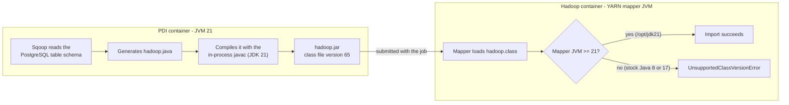
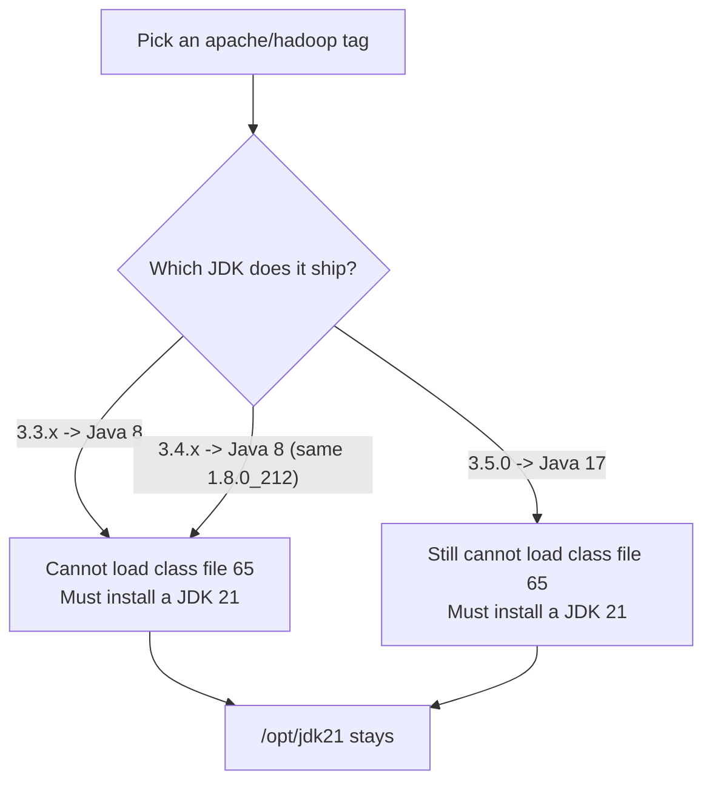

# Sqoop, Hadoop, PDI, and the Java version problem

Why the integration-test Hadoop container installs its own JDK 21, why the MapReduce settings carry
`--add-opens` flags, and why upgrading the `apache/hadoop` base image does not make any of it go
away.

Everything in this document was measured against the images this repository actually uses. The
commands used are in [How to verify all of this yourself](#how-to-verify-all-of-this-yourself).

## Contents

- [1. The short version](#1-the-short-version)
- [2. Who runs which Java](#2-who-runs-which-java)
- [3. The one rule that causes everything](#3-the-one-rule-that-causes-everything)
- [4. What makes Sqoop different from every other step](#4-what-makes-sqoop-different-from-every-other-step)
- [5. Problem 1: the Hadoop image ships Java 8](#5-problem-1-the-hadoop-image-ships-java-8)
- [6. Problem 2: Java 17+ locks down reflection](#6-problem-2-java-17-locks-down-reflection)
- [7. Problem 3: the client is Hadoop 3.4.0, the server is 3.3.6](#7-problem-3-the-client-is-hadoop-340-the-server-is-336)
- [8. Why a newer `apache/hadoop` image does not fix it](#8-why-a-newer-apachehadoop-image-does-not-fix-it)
- [9. What would actually remove the workaround](#9-what-would-actually-remove-the-workaround)
- [10. Applying this to a plain docker-compose cluster](#10-applying-this-to-a-plain-docker-compose-cluster)
- [11. Symptom to cause quick reference](#11-symptom-to-cause-quick-reference)
- [12. How to verify all of this yourself](#12-how-to-verify-all-of-this-yourself)
- [13. Where each workaround lives in this repo](#13-where-each-workaround-lives-in-this-repo)

## 1. The short version

Sqoop is the only step in the fixture that **writes and compiles Java source code while the job is
running**. It compiles that code inside the PDI container, using PDI's JDK, and then ships the
resulting `.class` files to a YARN mapper on the Hadoop side to be executed there.

PDI 11.1 runs **Java 21**. Java bytecode can only run on a JVM of the same version or newer. So the
Hadoop side has to run **Java 21 or newer as well** - otherwise the mapper cannot even load the class
Sqoop just produced.

The stock `apache/hadoop` images ship Java 8 (3.3.x and 3.4.x) or Java 17 (3.5.0). None of them ships
Java 21. That is the whole reason the derived image downloads a JDK into `/opt/jdk21` and points
`JAVA_HOME` at it.



## 2. Who runs which Java

Measured by running `java -version` inside each image:

| Where | Image | Java it ships | `JAVA_HOME` |
| --- | --- | --- | --- |
| PDI client | `automation/pdi-client:11.1` | **OpenJDK 21.0.11** | not set as an env var |
| Hadoop base (current) | `apache/hadoop:3.3.6` | OpenJDK **1.8.0_212** | `/usr/lib/jvm/jre/` |
| Hadoop base (newer 3.4 line) | `apache/hadoop:3.4.1` | OpenJDK **1.8.0_212** - identical | `/usr/lib/jvm/jre/` |
| Hadoop base (newest published) | `apache/hadoop:3.5.0` | Temurin **17.0.18+8** | `/opt/java/openjdk` |
| Hadoop container as we run it | `bigdata-it-hadoop:11.1` | **Temurin 21** installed at `/opt/jdk21` | `/opt/jdk21` (set in the pom) |

The last row is the workaround. Rows 2 to 4 are what you get out of the box.

## 3. The one rule that causes everything

Every `.class` file starts with the magic number `CAFEBABE` followed by the **class file version**
that `javac` targeted. A JVM refuses to load a class whose version is **higher** than its own.

| Java release | Class file major version |
| --- | --- |
| Java 8 | 52 |
| Java 11 | 55 |
| Java 17 | 61 |
| Java 21 | **65** |

- Java 21 JVM runs bytecode 52, 55, 61, 65 - anything up to its own version. Backwards compatible.
- Java 17 JVM runs 52, 55, 61. It **cannot** run 65.
- Java 8 JVM runs 52 only.

The failure is not subtle. It is thrown at class-load time:

```text
java.lang.UnsupportedClassVersionError: hadoop has been compiled by a more recent version of the
Java Runtime (class file version 65.0), this version of the Java Runtime only recognizes class file
versions up to 52.0
```

For normal Java projects this never bites you, because the bytecode was compiled once, at build
time, by a build you control. Sqoop breaks that assumption.

## 4. What makes Sqoop different from every other step

A Sqoop import is not "one program that copies rows". It is a code generator plus a MapReduce job:

```mermaid
sequenceDiagram
    participant PDI as PDI container (JVM 21)
    participant PG as PostgreSQL container
    participant RM as YARN ResourceManager (Hadoop container)
    participant AM as ApplicationMaster JVM
    participant MAP as Mapper JVM

    PDI->>PG: read table metadata for public.hadoop
    PDI->>PDI: generate hadoop.java (an ORM class per table)
    PDI->>PDI: compile it with ToolProvider.getSystemJavaCompiler()
    Note over PDI: no -source / -target / --release is passed,<br/>so javac targets its own release: 21
    PDI->>PDI: package the classes into hadoop.jar
    PDI->>RM: submit the MapReduce job + hadoop.jar
    RM->>AM: launch ApplicationMaster
    AM->>MAP: launch mapper container
    MAP->>MAP: load hadoop.class  <-- the version check happens here
    MAP->>PG: SELECT rows via JDBC
    MAP->>MAP: write records to HDFS
```



Two details make this unavoidable:

1. **The compiler used is the client's.** `org.apache.sqoop.orm.CompilationManager` calls
   `ToolProvider.getSystemJavaCompiler()`, i.e. the `javac` embedded in the JVM that PDI is running
   on. It is not a separate toolchain you can point somewhere else.
2. **No bytecode target is requested.** The only arguments Sqoop 1.4.7 passes are `-sourcepath`,
   `-classpath` and `-d`. There is no `-source`, `-target`, or `--release`. When no target is
   specified, `javac` targets its own release. On PDI 11.1 that is 21.

So the bytecode version shipped to the mapper is decided entirely by the PDI container's JDK, and
Sqoop 1.4.7 gives you no setting to lower it.

Proof from the fixture - the first 8 bytes of the class Sqoop generated during the last `SqoopIT`
run, read straight out of the PDI container:

```text
202 254 186 190   0   0   0  65
 CA  FE  BA  BE  minor=0   major=65   ->  Java 21
```

## 5. Problem 1: the Hadoop image ships Java 8

`apache/hadoop:3.3.6` contains OpenJDK 1.8.0_212. The NodeManager launches mapper JVMs using the
`JAVA_HOME` it inherits, so without intervention the mapper is a Java 8 JVM, and it cannot load
class file version 65.

The fix in [pentaho-platform/pom.xml](pentaho-platform/pom.xml) has two halves. First, the image
build downloads a JDK 21 and unpacks it to `/opt/jdk21`:

```xml
<runCmds>
  <run>curl -fsSL --retry 3 -o /tmp/jdk21.tar.gz https://api.adoptium.net/v3/binary/latest/21/ga/linux/x64/jdk/hotspot/normal/eclipse</run>
  <run>mkdir -p /opt/jdk21; tar -xzf /tmp/jdk21.tar.gz -C /opt/jdk21 --strip-components=1; rm -f /tmp/jdk21.tar.gz</run>
</runCmds>
```

Second, the container environment points Hadoop at it:

```xml
<env>
  <HADOOP_ROOT_LOGGER>INFO,console</HADOOP_ROOT_LOGGER>
  <JAVA_HOME>/opt/jdk21</JAVA_HOME>
  <HADOOP_OPTS>--add-opens java.base/java.lang=ALL-UNNAMED</HADOOP_OPTS>
</env>
```

`JAVA_HOME` here does double duty: the Hadoop daemons themselves start on Java 21, and the YARN
containers the NodeManager forks inherit the same JDK, which is what actually matters for the
mapper.

The base image is still Java 8 underneath; `/opt/jdk21` is an additional JDK, not a replacement.

## 6. Problem 2: Java 17+ locks down reflection

Running Hadoop 3.3.6 on Java 21 solves the class version problem and immediately creates a second
one. Hadoop 3.3.x was designed for Java 8 and 11. Several of its dependencies (Guice/CGLIB paths in
the YARN web stack, among others) reflect into JDK internals such as `java.lang.ClassLoader`.

Java 16 turned on strong encapsulation of JDK internals by default. From Java 17 onwards that
reflection throws `InaccessibleObjectException` / `IllegalAccessError` unless the package is
explicitly opened.

Hence the flag in three places:

| Where | Setting | Protects |
| --- | --- | --- |
| Container env (`HADOOP_OPTS`) | `--add-opens java.base/java.lang=ALL-UNNAMED` | the NameNode, DataNode, ResourceManager, NodeManager daemons |
| `yarn.app.mapreduce.am.command-opts` | `-Xmx1024m --add-opens java.base/java.lang=ALL-UNNAMED` | the ApplicationMaster JVM |
| `mapreduce.map.java.opts` / `mapreduce.reduce.java.opts` | `-Xmx384m --add-opens java.base/java.lang=ALL-UNNAMED` | the mapper and reducer JVMs |

This is not Sqoop-specific. It is the price of running a Hadoop release on a JDK newer than the one
it was built for.

## 7. Problem 3: the client is Hadoop 3.4.0, the server is 3.3.6

The `apachevanilla` shim inside the PDI container ships **Hadoop 3.4.0** client libraries and
**Sqoop 1.4.7**, while the fixture's server runs **Hadoop 3.3.6**:

```text
plugins/pentaho-big-data-plugin/hadoop-configurations/apachevanilla/lib/hadoop-common-3.4.0.jar
plugins/pentaho-big-data-plugin/hadoop-configurations/apachevanilla/lib/hadoop-mapreduce-client-core-3.4.0.jar
plugins/pentaho-big-data-plugin/hadoop-configurations/apachevanilla/lib/sqoop-1.4.7.jar
```

Hadoop 3.4.0 added a property that 3.3.6 does not know about. Straight from the 3.4.0
`mapred-default.xml` bundled in the shim:

```xml
<property>
  <name>mapreduce.jvm.add-opens-as-default</name>
  <value>true</value>
  <description>Since on JDK17 it's no longer possible to use the reflection API to
    access non-public fields and methods add-opens flags should be added to MR AM
    and map/reduce containers regardless of the user specified java opts. Setting
    this to true will add the flags to the container launch commands on nodes with
    JDK17 or higher. Defaults to true, but the setting has no effect on nodes using
    JDK16 and before.
  </description>
</property>
```

The same file extracted from the server's `hadoop-mapreduce-client-core-3.3.6.jar` contains **zero**
occurrences of `add-opens` or `ADD_OPENS`. The client and the server therefore disagree about how
the task command line should be built: the 3.4.0 client wants to inject its own add-opens handling,
the 3.3.6 node has no code to complete it, and the task JVM ends up with a launch command it cannot
run.

That is why the fixture sets the property to `false` **on both sides** and supplies the flags
explicitly instead:

- server side: [pentaho-platform/docker/hadoop/config/mapred-site.xml](pentaho-platform/docker/hadoop/config/mapred-site.xml)
- client side: `mapredSite()` in [pentaho-platform/src/test/java/org/pentaho/big/data/it/NamedClusterMetastoreBuilder.java](pentaho-platform/src/test/java/org/pentaho/big/data/it/NamedClusterMetastoreBuilder.java), which writes the site file into the named cluster the PDI job uses

Keeping the two in sync is deliberate: a MapReduce launch command is assembled partly from client
configuration and partly from node configuration, so a setting that exists on only one side produces
confusing, half-applied behaviour.

## 8. Why a newer `apache/hadoop` image does not fix it

The published tags today are `3.5.0`, `3.4.3`, `3.4.2`, `3.4.2-lean`, `3.4.1`, `3.4.0`, `3.3.6`,
`3.3.5`, `2.10.x`, plus `runner-jdk17-u2404`.



- **`apache/hadoop:3.4.1` changes nothing.** It ships the exact same OpenJDK 1.8.0_212 at the same
  `JAVA_HOME` as 3.3.6. The JDK 21 install would still be required, unmodified.
- **`apache/hadoop:3.5.0` gets closer but is still short.** Temurin 17 can run class file 61, and
  Sqoop is producing 65. `UnsupportedClassVersionError` again, just with a different "recognizes up
  to" number.
- **No published tag ships Java 21**, so no base-image bump alone removes `/opt/jdk21`.

A base-image bump is not free either. If you do try it, budget for:

| Consequence | Detail |
| --- | --- |
| `JAVA_HOME` moves | 3.5.0 uses `/opt/java/openjdk`, 3.3.x/3.4.x use `/usr/lib/jvm/jre/`. Anything that assumes a path needs revisiting. |
| add-opens behaviour changes | On 3.4.x/3.5.0 the server understands `mapreduce.jvm.add-opens-as-default`, so the client/server mismatch from section 7 disappears and some explicit flags may become redundant. Needs testing, not assumption. |
| Shim compatibility | The named cluster uses `shimIdentifier=apachevanilla`, whose libraries are Hadoop 3.4.0. Running it against a 3.5.0 server is a new combination. |
| Startup command | The fixture starts the daemons itself; directory layout and script names in a new base image must still match. |

## 9. What would actually remove the workaround

| Option | What it means | Trade-off |
| --- | --- | --- |
| Keep installing JDK 21 (today's design) | Derived image downloads Temurin 21 into `/opt/jdk21` | Works; adds a download to every image build. Pinning the version plus checksum would make it reproducible and offline-friendly. |
| Build the fixture image from a Java 21 base | Start from `eclipse-temurin:21` and lay a Hadoop tarball on top instead of starting from `apache/hadoop` | Full control of the JDK; you now own the Hadoop install layout that the base image gave you for free. |
| Lower the bytecode Sqoop produces | Would let a Java 17 node work | Not available: Sqoop 1.4.7 passes no `-target`/`--release` to `javac`, so the target follows the PDI JVM. Would require patching Sqoop or the shim. |
| Run PDI on an older JDK | Removes the requirement at the source | Not realistic - PDI 11.1 is a Java 21 product. |

The practical conclusion: the JDK 21 install stays. The only sensible improvement is to pin it
instead of resolving Adoptium's `latest` on every build.

## 10. Applying this to a plain docker-compose cluster

The same rule applies to any hand-rolled cluster, and it is easy to misread which container matters:

- The container that **compiles** the Sqoop ORM class is the one running the Sqoop client. Its JDK
  sets the bytecode version.
- The container that **executes** the mapper is the NodeManager. Its JDK must be greater than or
  equal to the one above.
- NameNode, DataNode, and ResourceManager do not load the generated class at all, so their JDK is
  irrelevant to this particular problem.

So in a compose file, mixing `apache/hadoop:3.4.1` for the storage/scheduling daemons with a
different image for the nodemanager only helps if the nodemanager's JDK is at least as new as the
Sqoop client's JDK. A Java 17 nodemanager is fine when the Sqoop client is Java 8, 11, or 17 - and
fails the moment the client is Java 21, which is exactly the PDI case.

Quick check for any cluster:

```powershell
docker run --rm --entrypoint java <nodemanager-image> -version   # must be >= the next line
docker run --rm --entrypoint java <sqoop-client-image> -version
```

## 11. Symptom to cause quick reference

| Symptom in the logs | Cause | Fix |
| --- | --- | --- |
| `UnsupportedClassVersionError ... class file version 65.0 ... up to 52.0` | Mapper JVM is Java 8; Sqoop compiled with Java 21 | `JAVA_HOME=/opt/jdk21` on the Hadoop container |
| `UnsupportedClassVersionError ... up to 61.0` | Mapper JVM is Java 17 (for example a stock `apache/hadoop:3.5.0`) | Same fix - a Java 21+ runtime is required |
| `InaccessibleObjectException` / `IllegalAccessError` from Guice, CGLIB, or `java.lang.ClassLoader` in a daemon or AM log | Hadoop 3.3.6 reflecting into `java.base` on Java 21 | `--add-opens java.base/java.lang=ALL-UNNAMED` in `HADOOP_OPTS` and in the AM/map/reduce java opts |
| Task JVM never starts and the container launch command looks mangled around the add-opens flags | Hadoop 3.4.0 client vs 3.3.6 node disagreement | `mapreduce.jvm.add-opens-as-default=false` on **both** client and server, flags passed explicitly |
| Sqoop reaches `Retrieved 2 records.` but the mapper fails afterwards | Codegen and JDBC worked; the failure is in the YARN container - check the class version and add-opens items above | - |

## 12. How to verify all of this yourself

All commands are PowerShell-safe. Avoid `docker ... /bin/bash -c '...'` with pipes or nested quotes
in PowerShell 5.1 - it mangles the string. Use `--entrypoint`, or pass plain arguments, as below.

**Which JDK does an image ship?**

```powershell
docker run --rm --entrypoint java apache/hadoop:3.3.6 -version
docker run --rm --entrypoint java apache/hadoop:3.4.1 -version
docker run --rm --entrypoint java apache/hadoop:3.5.0 -version
docker run --rm --entrypoint printenv apache/hadoop:3.5.0 JAVA_HOME
```

**What bytecode version did Sqoop actually generate?** With the fixture containers still up:

```powershell
$pdi = docker ps --filter "name=bigdata-it-pdi" --format "{{.ID}}"
docker exec $pdi find /tmp -name 'hadoop.class'
docker exec $pdi od -An -tu1 -N8 /tmp/sqoop-root/compile/<hash>/hadoop.class
```

The last byte is the class file major version: `65` means Java 21.

**Does a Hadoop version know about the add-opens property?**

```powershell
$hadoop = docker ps --filter "name=bigdata-it-hadoop" --format "{{.ID}}"
docker exec -w /tmp $hadoop /opt/jdk21/bin/jar -xf /opt/hadoop/share/hadoop/mapreduce/hadoop-mapreduce-client-core-3.3.6.jar mapred-default.xml
docker exec $hadoop grep -c "add-opens" /tmp/mapred-default.xml
```

`0` means the version has no such property. Repeat against the shim's
`hadoop-mapreduce-client-core-3.4.0.jar` inside the PDI container to see the difference.

**Which Hadoop and Sqoop libraries does the shim use?**

```powershell
docker exec $pdi find / -name 'hadoop-common-*.jar' -not -path '/proc/*'
docker exec $pdi find / -name 'sqoop*.jar' -not -path '/proc/*'
```

## 13. Where each workaround lives in this repo

| Concern | File | What to look for |
| --- | --- | --- |
| JDK 21 download and `JAVA_HOME` | [pentaho-platform/pom.xml](pentaho-platform/pom.xml) | the `<runCmds>` block and the Hadoop container `<env>` |
| Server-side MapReduce settings | [pentaho-platform/docker/hadoop/config/mapred-site.xml](pentaho-platform/docker/hadoop/config/mapred-site.xml) | `mapreduce.jvm.add-opens-as-default`, `*.java.opts` |
| Client-side MapReduce settings | [pentaho-platform/src/test/java/org/pentaho/big/data/it/NamedClusterMetastoreBuilder.java](pentaho-platform/src/test/java/org/pentaho/big/data/it/NamedClusterMetastoreBuilder.java) | the `mapredSite()` method |
| The test that exercises the whole path | [pentaho-platform/src/test/java/org/pentaho/big/data/it/SqoopIT.java](pentaho-platform/src/test/java/org/pentaho/big/data/it/SqoopIT.java) | expects `Retrieved 2 records.` and two rows in HDFS |
| Fixture overview, commands, troubleshooting | [plugin-integration-test-readme.md](plugin-integration-test-readme.md) | "How the fixture works" and "Troubleshooting" |
